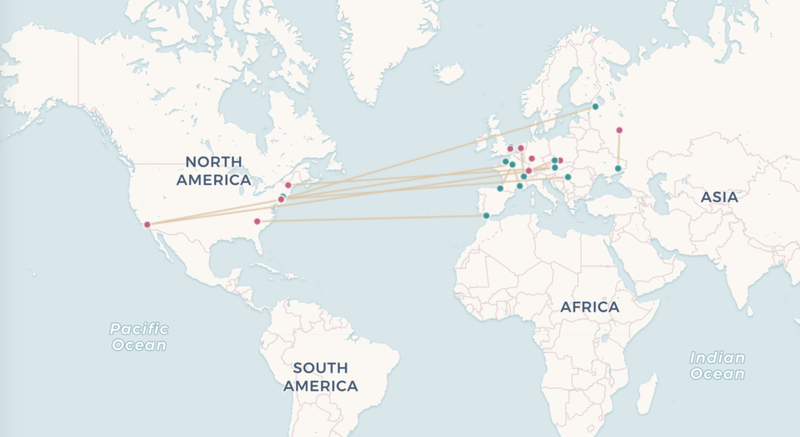

# Composers Map

This map shows the corpus composers' birth and death dates and places (city and country), nationality. It also includes metadata for corpus representation in terms of works and examples ID extracted from these works. The original interactive map included line features connecting the birth and death locations. Birth and death locations are shown in different colours (birth = green; death = red). Birth and death data points are connect with lines. Metadata is shown in pop-ups that are activated by clicking on a point.

Birth metadata include the following fields:
- Composer
- Nationality
- Date
- City
- Country
- Corpus Works
- Corpus Examples

Death metadata include the following fields:
- Composer
- Nationality
- Date
- City
- Country
- Corpus Works
- Corpus Examples

NOTES: 
- Date, City, and Country change based on birth vs. death data points. Other fields (nationality, corpus works, and corpus examples) uprovide the same metadata for each composer.
- Birth and death locations are given using two data points: City and Country. In cases where locations have changed name, both names are given, with the modern name given in parentheses.
- Corpus Representation is available on the composers' page by number of works and number of examples (https://polyrhythm.humdrum.org/composers/). Please provide the number, with % of the whole corpus in parentheses (one decimal), e.g., 40 works (8.9%). These will need to added to the csv/GeoJSON files.

# Proposed Solution

Starting with qgis2web map (./composers-birth-death/index.html), see if this satisfies the desired map. If not how close are we? What needs to be changed? Are there concerns about the number of files/folders?

Depending on the outcome:

1. Create map document using Leaflet JS/CSS, using a CARTO basemap ([https://github.com/CartoDB/basemap-styles](https://github.com/CartoDB/basemap-styles)). Alternatively Stamen Designs or other OpenStreetMap-based basemap that allows use without API.
2. Use existing GeoJSON data in `./composers-birth-death/data` to create new layer groups for each composer. Each layer group will include a styled birth and death markers, and a line connecting them. Will be stored in the `composers` directory.
3. Test and implement Leaflet layer controls ([https://leafletjs.com/examples/layers-control/](https://leafletjs.com/examples/layers-control/)). These should:

- display all composers on map load
- have options to displate one or more selected composers from a list, or none.

4. Add to the resulting `composers-map.html` file inline comments inside the `<html>` and `<script>` tags to indicate where and how to make future configurations. This README.md will also include written instructions describing the files/content of this directory.

# Further Explorations

- [https://www.tutorialspoint.com/leafletjs/leafletjs_layers_group.htm](https://www.tutorialspoint.com/leafletjs/leafletjs_layers_group.htm) – Tutorial for working with Leaflet layer groups
- [https://www.npmjs.com/package/leaflet.control.layers.tree](https://www.npmjs.com/package/leaflet.control.layers.tree) - This plugin extends `Control.Layers` allowing a tree structure for the layers layout.
