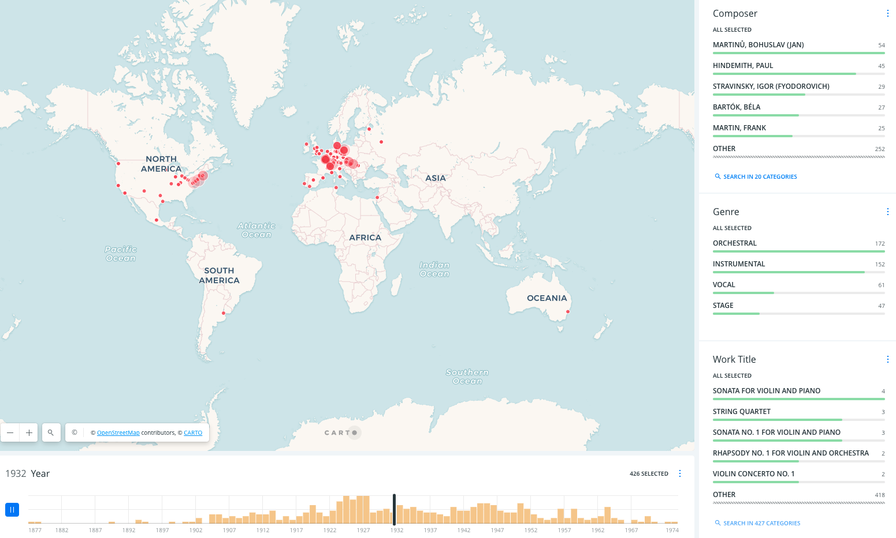

# Timeline Map

This map is meant to show the locations of where certain works premiered over time. All metadata is availble on FDS_Metadata_1900DS_ArcGIS_18May2019_master (https://docs.google.com/spreadsheets/d/17rjKQ3lXJHEHAcDfOXTDNX5a0A_jVqwokcaqhd3Ddng/edit?usp=sharing)

Metadata points for this map include:
- Composer Name
- Work Title
- Genre (Sub-genre)
- Date of Composition
- Date of First Public Performance
- Date of Publication
- Location of Premiere: Venue, City, Country
- Performing Ensemble, Conductor, Soloist(s)
- Corpus Examples

NOTES:
- In cases where the venue in unknown, use "unknown" as data point and use gocoding for city
- In cases where there is no performing ensemble, conductor, or soloist, use "none" or "unknown" as datapoint (refer to FDS master)
- Corpus Examples are listed anbd associated with links to website example pages (https://polyrhythm.humdrum.org/)

The timeline feature allowed users to "play" the map to show locations highlight in the map automatically as the slider moved through time.

# Proposed Solution

1. Create map document using Leaflet JS/CSS, using a CARTO basemap ([https://github.com/CartoDB/basemap-styles](https://github.com/CartoDB/basemap-styles)). Alternatively Stamen Designs or other OpenStreetMap-based basemap that allows use without API.
2. Transform a copy of existing csv data into GeoJSON to be queried and displayed as map layer. This GeoJSON file will be stored in this `timeline` directory.
3. Test and implement Leaflet time slider plugin (example: [http://dwilhelm89.github.io/LeafletSlider/](http://dwilhelm89.github.io/LeafletSlider/)).
4. Add to the resulting `timeline-map.html` file inline comments inside the `<html>` and `<script>` tags to indicate where and how to make future configurations. This README.md will also include written instructions describing the files/content of this directory.

# Further Explorations

- [https://github.com/hallahan/LeafletPlayback](https://github.com/hallahan/LeafletPlayback) – This is a Leaflet plug-in that plays back points that have a time stamp synchronized to a clock.
- [https://github.com/skeate/Leaflet.timeline](https://github.com/skeate/Leaflet.timeline) - Display arbitrary GeoJSON on a map with a timeline slider and play button.
- [https://piratefsh.github.io/how-to/2015/10/16/animating-leaflet-markers.html](https://piratefsh.github.io/how-to/2015/10/16/animating-leaflet-markers.html) - Animating Leaflet markers
- [http://boazsobrado.com/blog/2018/02/08/leaflet-timeline-in-r/](http://boazsobrado.com/blog/2018/02/08/leaflet-timeline-in-r/) - Leaflet timeline in R
- [https://www.youtube.com/watch?v=XvKu6_b6aRM](https://www.youtube.com/watch?v=XvKu6_b6aRM) - Learn Leaflet with Mapster - Animation
- [https://leafletjs.com/reference.html#geojson-filter](https://leafletjs.com/reference.html#geojson-filter) - Built-in GeoJSON filtering option
- [https://www.youtube.com/watch?v=x4MGSkw6QnM](https://www.youtube.com/watch?v=x4MGSkw6QnM) - Learn Leaflet with Mapster - Filters (dropdowns)
